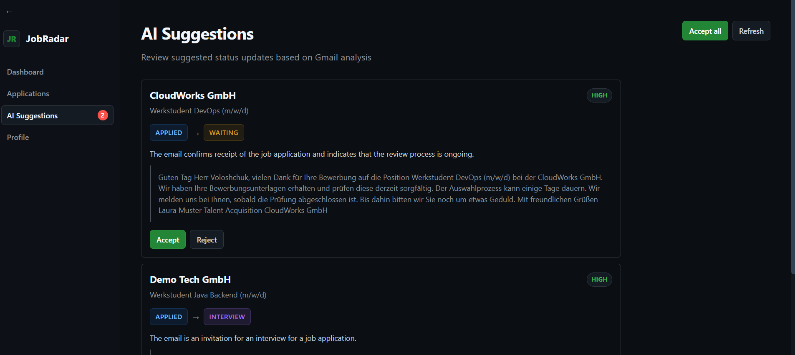
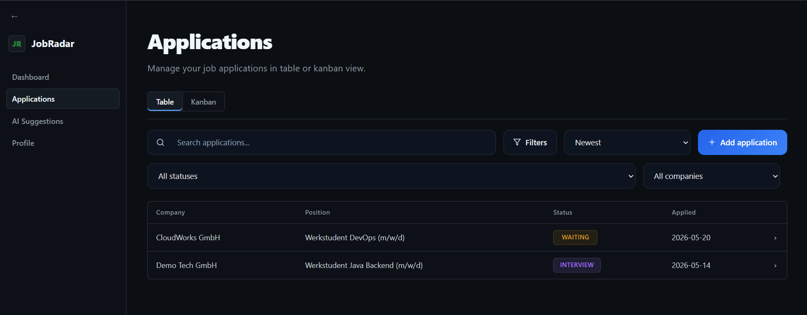
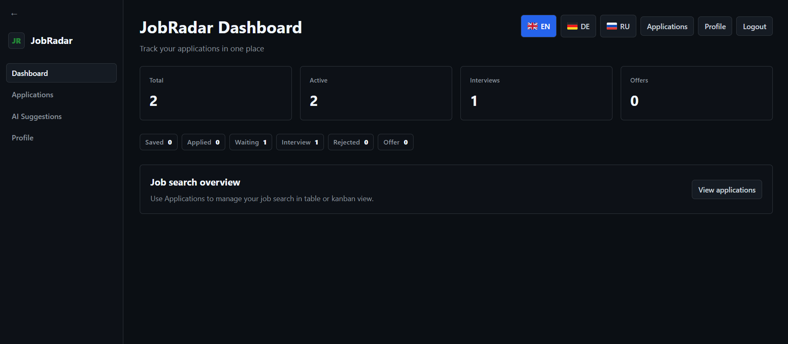
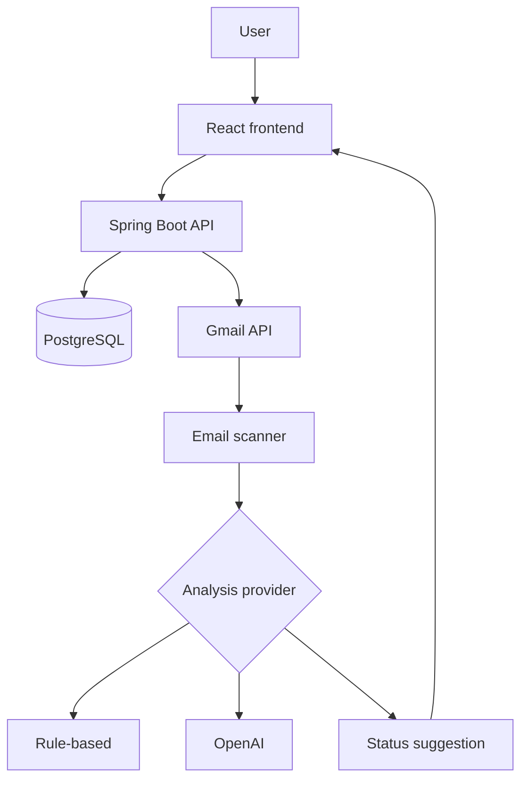

# JobRadar

[](https://github.com/Tikhon-Voloshchuk-02/JobRadar/actions/workflows/ci.yml)
[](https://github.com/Tikhon-Voloshchuk-02/JobRadar/releases)
[](https://openjdk.org/projects/jdk/21/)
[](https://spring.io/projects/spring-boot)

JobRadar is a full-stack application for tracking job applications and reducing manual status updates. It connects to Gmail, analyzes recruiting emails, matches them to existing applications, and proposes status changes that the user can review before accepting.

**Live application:** [jobradar.xyz](https://jobradar.xyz)

## How it works

1. The user creates and manages job applications in table or Kanban view.
2. A background scanner retrieves relevant recruiting emails through the Gmail API.
3. The email is matched to an existing company and position.
4. A rule-based or OpenAI-backed provider classifies the message and proposes a status transition.
5. The user accepts or rejects the suggestion before the application is updated.

## Screenshots

### AI-assisted status suggestions



### Application tracking



### Dashboard



The screenshots contain synthetic demonstration data.

## Features

- Application management with search, filters, sorting, and status history
- Table and Kanban views for tracking the application pipeline
- Dashboard with application and interview statistics
- Google OAuth2 authentication and Gmail integration
- Scheduled Gmail inbox scanning
- Company and position matching for incoming recruiting emails
- Rule-based and OpenAI-backed email classification
- Confidence-ranked status suggestions with manual accept/reject flow
- Validation of allowed application status transitions
- CV and cover-letter document management
- English, German, and Russian user interfaces

## Architecture

JobRadar currently runs as a single Spring Boot deployment. The React frontend is built into static assets and served by the backend. PostgreSQL stores application data, status history, Gmail connections, and generated suggestions.



The analysis provider is abstracted behind a common interface, allowing the application to use deterministic rules by default and OpenAI as an optional fallback/provider.

## Tech stack

| Area | Technologies |
| --- | --- |
| Backend | Java 21, Spring Boot 3.5, Spring Web, Spring Data JPA |
| Security | Spring Security, JWT, Google OAuth2 |
| Data | PostgreSQL 15, H2 for tests |
| Frontend | React 19, Vite 8, React Router, i18next, dnd-kit |
| Integrations | Gmail API, OpenAI API |
| Testing | Spring Boot Test, Spring Security Test, Maven Surefire |
| Infrastructure | Docker, Docker Compose, GitHub Actions, Linux |

## Local setup

### Prerequisites

- Docker with Docker Compose
- Node.js 22 and npm
- Google OAuth credentials if Gmail integration is required
- An OpenAI API key only when using the OpenAI provider

### 1. Clone the repository

```bash
git clone https://github.com/Tikhon-Voloshchuk-02/JobRadar.git
cd JobRadar
```

### 2. Build the frontend

```bash
cd frontend
npm ci
npm run build
mkdir -p ../backend/src/main/resources/static
cp -r dist/. ../backend/src/main/resources/static/
cd ..
```

### 3. Configure environment variables

Create a `.env` file in the repository root:

```dotenv
POSTGRES_PASSWORD=change-me
JWT_SECRET=replace-with-a-long-random-secret

GOOGLE_CLIENT_ID=
GOOGLE_CLIENT_SECRET=
GOOGLE_REDIRECT_URI=

MAIL_USERNAME=
MAIL_PASSWORD=

APP_FRONTEND_URL=http://localhost:8080

AI_PROVIDER=RULE_BASED
OPENAI_API_KEY=
OPENAI_MODEL=gpt-4o-mini
```

For Gmail integration, add the same value used by `GOOGLE_REDIRECT_URI` to the authorized redirect URIs in the Google Cloud OAuth client.

`RULE_BASED` is the default AI provider and does not require an OpenAI API key. Do not commit the `.env` file or any credentials.

### 4. Start the application

```bash
docker compose up --build
```

Open [http://localhost:8080](http://localhost:8080).

Stop the application with:

```bash
docker compose down
```

The PostgreSQL data is retained in the `postgres_data` Docker volume.

## Tests and quality checks

Run the backend test suite:

```bash
cd backend
./mvnw clean test
```

Build and lint the frontend:

```bash
cd frontend
npm ci
npm run lint
npm run build
```

Validate the Docker build:

```bash
docker compose build
```

## CI/CD

GitHub Actions runs three checks for pushes and pull requests:

- backend compilation and tests with Java 21;
- frontend installation and production build with Node.js 22;
- Docker Compose build validation.

Production deployment is started manually through a separate GitHub Actions workflow. It connects to the server over SSH, builds the frontend, packages it into the Spring Boot application, rebuilds the backend container, and restarts the Docker Compose services.

## Project structure

```text
JobRadar/
├── backend/                # Spring Boot API, business logic and integrations
├── frontend/               # React single-page application
├── .github/workflows/      # CI and deployment workflows
├── docs/screenshots/       # README screenshots
├── docker-compose.yml      # Backend and PostgreSQL services
└── README.md
```

## Current status

The current release is **v0.3.3**. The core application workflow is operational: users can manage applications, connect Gmail, receive status suggestions, and approve or reject the proposed changes.

Planned improvements include broader integration-test coverage, improved observability, safer OAuth connection management, and preparation for public beta testing.

## Author

Developed by [Tikhon Voloshchuk](https://github.com/Tikhon-Voloshchuk-02).
